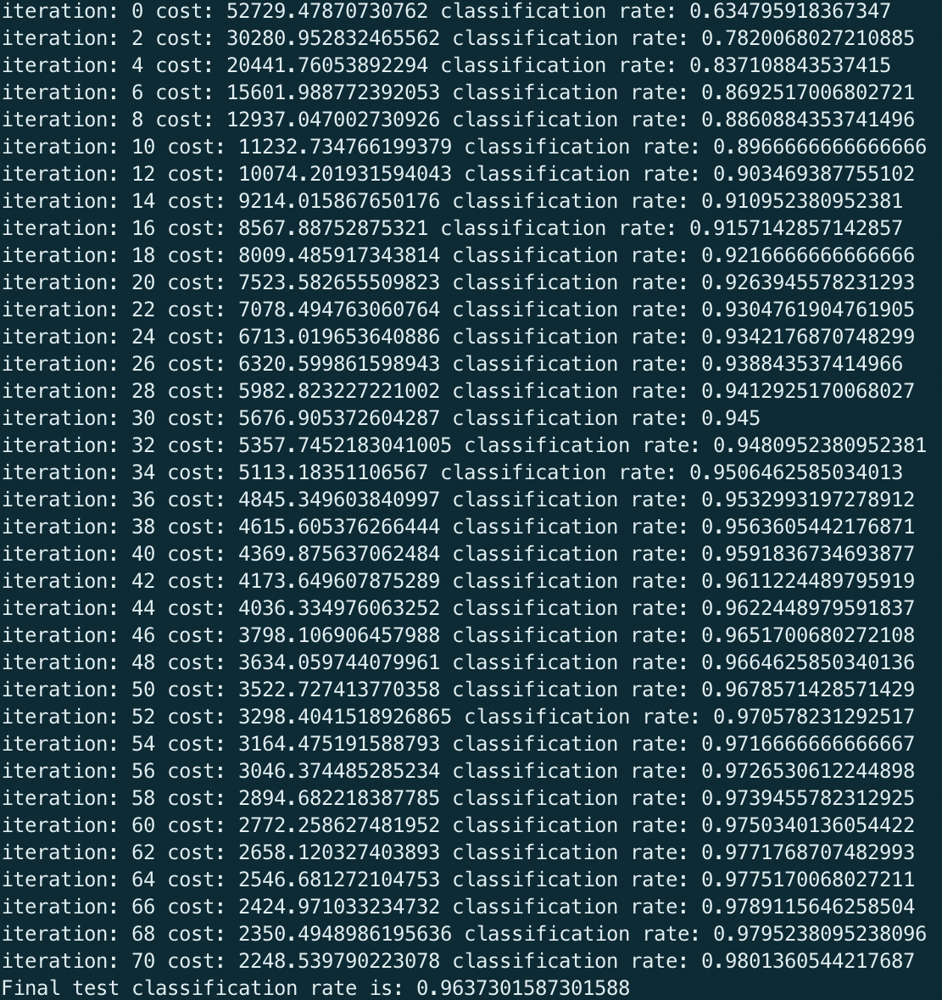
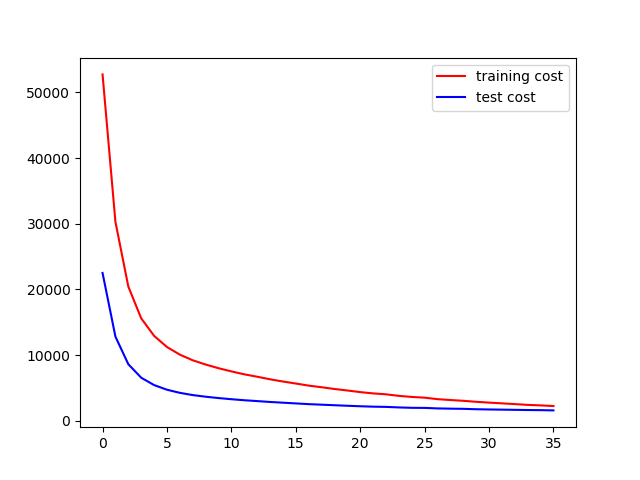
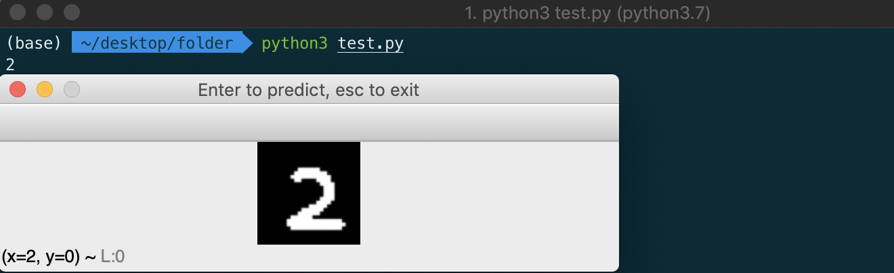

# Trainable Interactive Digit Recognizer
This is trainable deep learning model of a digit recognizer written in Python implemented using Theano.
> The code implements user RMSProp as the optimizer and also performs Batch Stochastic Gradient Desent

The code trains a neral netwwork on the given data and saves the model in csv files. Then you can run the second file which will open a drawing window using OpenCV where you can draw numbers and test the predictions.
Here are some things you can do with it.
  - Train the model by providing custom data
  - Test the accuracy by drawing digits by hand
  - It is not necessary to tun the training file as I have already trained the model and saved it!

## Usage
##### Training the model
You can edit the hyperparameters in train.py file
  - M1 - Size of hidden layer 1
  - M2 - Size of hidden layer 2
  - Learning rate for Batch Stochastic Gradient Descent
  - Decay rate for RMSProp
  - iter - Maximum iterations through the data
  - every - This will print the classification rate and cost every n iterations
  - bs - this is the batch size for Batch SGD
```python
# set hyperparameters
N = Xtrain.shape[0]
D = Xtrain.shape[1]
M1 = 300
M2 = 200
K = Ytrain.shape[1]
learning_rate = 0.0001
decay = 0.99
iter = 72
every = 2
bs = 1000
```

Then you can run the file in shell.
Make sure you have all the necessary imports installed on your system
```sh
$ cd desktop/trainable-interavtive-digit-recognizer
$ python3 train.py
```
 
##### Testing the model
Just run the test.py file and you will see an OpenCV window pop.
You can then draw the numbers and test the predictions
```sh
$ python3 test.py
```


## Contributing
I feel like this is something that might be helpful to students trying to come up with quick solutions at hackathons.
Pull requests are welcome! Please let me know if this was helpful :)
Visit my [website](https://raghavkharbanda.com) if you wish to contact me!

## License
[MIT](https://choosealicense.com/licenses/mit/)